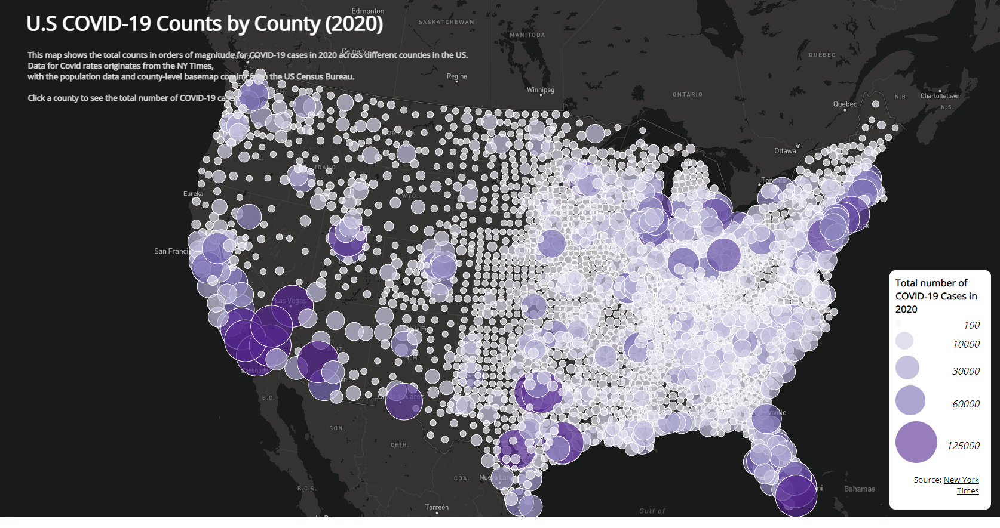

# Lab 3: Web Map Application 
Mitchell Stapelman

## Introduction
This lab introduces the Mapbox API through Javascript, where it is used to produce these two interactive maps visualizing 2020 COVID-19 rates and total count data for all counties across the US. The first choropleth map displays the case rates per 1000 people for each county, while the second is a proportional symbols map to show the total case counts. In conjunction, these maps show what regions were most affected and where the total number of COVID-19 cases were highest in the country. The data for this project comes from the [New York Times](https://github.com/nytimes/covid-19-data/blob/43d32dde2f87bd4dafbb7d23f5d9e878124018b8/live/us-counties.csv), with the [population data](https://data.census.gov/cedsci/table?g=0100000US.050000&d=ACS%205-Year%20Estimates%20Data%20Profiles&tid=ACSDP5Y2018.DP05&hidePreview=true) and [country basemap](https://www.census.gov/geographies/mapping-files/time-series/geo/carto-boundary-file.html) being from the US Census Bureau. The shapefiles of this data were converted to GeoJSON in order to adapt it for mapbox.

## Maps
### Map 1: 2020 Choropleth Map of COVID-19 Rates

### Map 2: 2020 Proportional Symbols Map of COVID-19 Rates

## Acknowledgements:
[Mapbox](https://docs.mapbox.com/mapbox.js/api/v3.3.1/)

[COVID-19 Data](https://github.com/nytimes/covid-19-data/blob/43d32dde2f87bd4dafbb7d23f5d9e878124018b8/live/us-counties.csv)

[Population Data](https://data.census.gov/cedsci/table?g=0100000US.050000&d=ACS%205-Year%20Estimates%20Data%20Profiles&tid=ACSDP5Y2018.DP05&hidePreview=true)

[Country Basemap](https://www.census.gov/geographies/mapping-files/time-series/geo/carto-boundary-file.html)

Data processing and lab structure made by Bo Zhao and Steven Bao.